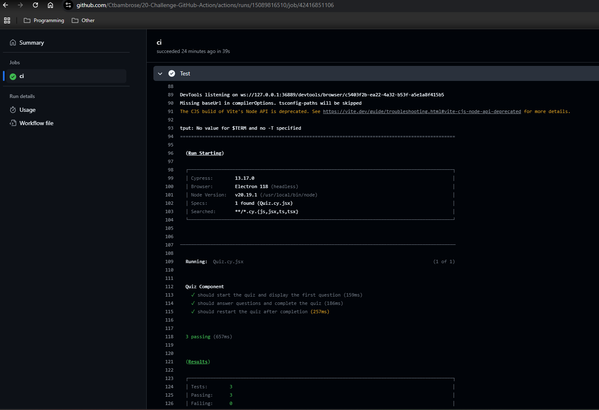
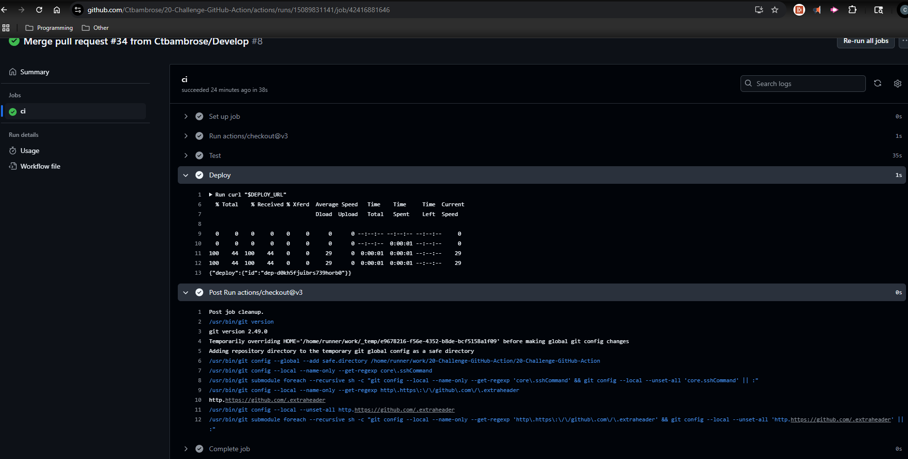
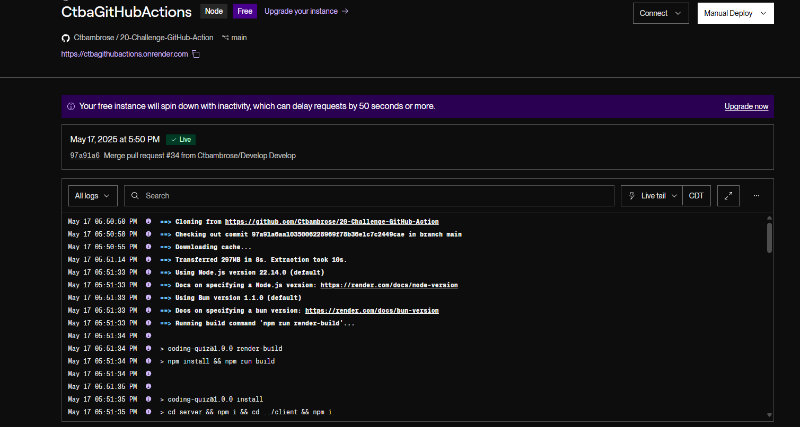

# 20-Challenge-GitHub-Action

## Description
AS A developer looking to integrate a pipeline in a codebase for continuous integration and deployment,  I WANT to create a GitHub Action that will follow best practices by running test cases when a Pull Request is made to the develop branch SO THAT I can ensure that all code integrations are clean and pass the proper requirements.

## Installation

No installation is needed

## Usage

The application is a coding quiz, so you just click Start Quiz and answer the questions. The real part of the activity is checking in this repo's actions tab to see the successful running of the test for pull request on develop and main.

*This is a screenshot of the successful run of the Development branch automation.*

*This is a screenshot of the successful run of the Main branch automation.*

*This is a screenshot of the successful run of the automation in Render.*

[Link to App](https://ctbagithubactions.onrender.com)
